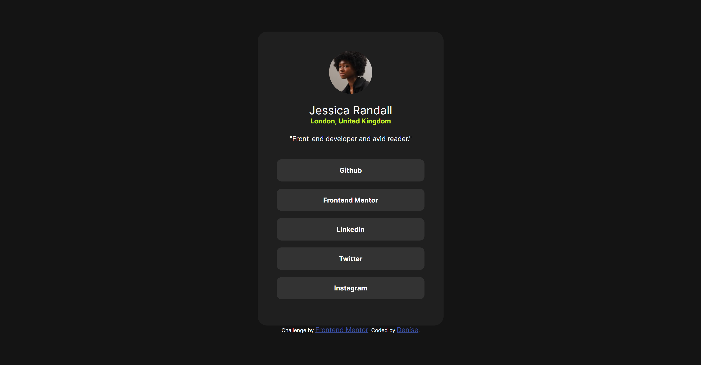

# Frontend Mentor - Social links profile solution

This is a solution to the [Social links profile challenge on Frontend Mentor](https://www.frontendmentor.io/challenges/social-links-profile-UG32l9m6dQ). Frontend Mentor challenges help you improve your coding skills by building realistic projects.

## Table of contents

- [Overview](#overview)
  - [The challenge](#the-challenge)
  - [Screenshot](#screenshot)
  - [Links](#links)
- [My process](#my-process)
  - [Built with](#built-with)
  - [What I learned](#what-i-learned)
  - [Continued development](#continued-development)
  - [Useful resources](#useful-resources)
- [Author](#author)

## Overview

### The challenge

Users should be able to:

- See hover and focus states for all interactive elements on the page

### Screenshot



### Links

- Solution URL: [Add solution URL here](https://your-solution-url.com)
- Live Site URL: [Add live site URL here](https://your-live-site-url.com)

## My process

### Built with

- Semantic HTML5 markup
- CSS custom properties
- Flexbox
- Mobile-first workflow

### What I learned

Nothing out of this worlds, but note worthy enough for me. I was having responsive issues with the profile card due to flex align centered and max-width combination the card stayed shrunken. This is what I did to make it the appropriate width based on the screen size.

```css
.card {
  margin: 0 auto;
  padding: 40px;
  width: 390px;
  max-width: 100%;
}
```

### Continued development

I had stepped away from the daily challenges, and learned some much needed JS. I haven't done any heavily JS focus challenges yet but I look forward to starting them.

### Useful resources

- [Example resource 1](https://www.mozilla.com) - widths and responsiveness

## Author

- Website - Under some updating not yet ready 😔
  - Frontend Mentor - [@yourusername](https://www.frontendmentor.io/profile/moncadad)

## Acknowledgments

Shoutout to me, keep going!!!
